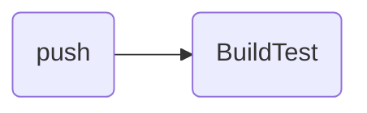
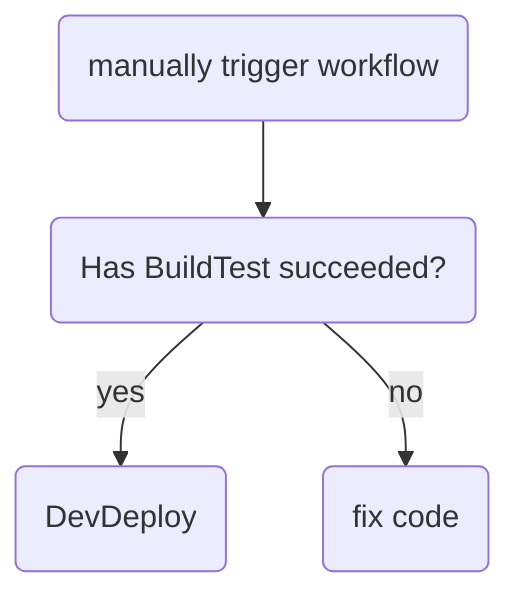
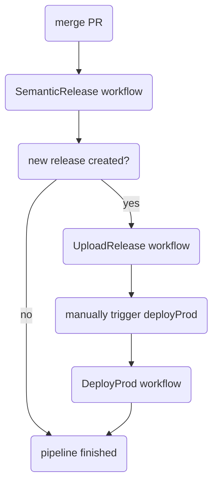

# Data Governance Center

[](https://github.deere.com/EDL/governance-UI/actions/workflows/DeployProd.yml)

<details>
<summary>

## Table of Contents

</summary>

- [About](#about)
- [Create Release](#create-release)
- [GitHub Actions](#github-actions)
  - [Testing](#testing)
  - [Deploying to Development](#deploying-to-development)
  - [Deploying to Production](#deploying-to-production)
- [Local Development](#local-development)
  - [Initial Setup](#initial-setup)
    - [Prerequisites](#prerequisites)
    - [Running the local server for the first time](#running-the-local-server-for-the-first-time)
  - [Running the Local Server](#running-the-local-server)
- [Feature Toggles](#feature-toggles)
  - [Finding Feature Toggles](#finding-feature-toggles)
  - [Creating a New Feature Toggle](#creating-a-new-feature-toggle)
  - [Updating a Feature Toggle](#updating-a-feature-toggle)
  - [Deleting a Feature Toggle](#deleting-a-feature-toggle)
  - [Using a Feature Toggle](#using-a-feature-toggle)
- [Managing Communities and subCommunities](#managing-communities-and-subcommunities)
  - [Adding a new community or subCommunity](#adding-a-new-community-or-subcommunity)
  - [Updating community and subCommunity](#updating-community-and-subcommunity)
- [Query to Find Old Branches](#query-to-find-old-branches)
- [Semantic Release](#semantic-release)
  - [Breaking Changes](#breaking-changes)
  - [Semantic Release Commit Types](#semantic-release-commit-types)
    - [feat](#feat)
    - [fix](#fix)
    - [docs](#docs)
    - [style](#style)
    - [refactor](#refactor)
    - [perf](#perf)
    - [test](#test)
    - [build](#build)
    - [ci](#ci)
    - [chore](#chore)
    - [revert](#revert)
- [Additional Documentation](#additional-documentation)

</details>

## About

The repository for [data-catalog.deere.com](https://data-catalog.deere.com).
- Uses React + NextJS, as well as Deere UXFrame styling
- `src` folder is the server side, `static`, `pages`, and `components` can be
  considered client side

## Create Release

Run `npm run commit` on your local machine when you are ready to make your final
commit before submitting a PR. This is a prerequisite for creating a new
release. You will have to select one of the commit types provided in the
command-line menu. Note that only the feat, fix, and perf types will trigger a
new release. For more details, see the [Semantic Release](#semantic-release)
section.

You can think of `npm run commit` as a replacement for `git commit`. You will
still need to use `git add` to add your changes to the staging area and `git
push` to push these changes to your remote branch.

## GitHub Actions

### Testing

The `BuildTest` workflow runs all the test cases against your code. This
workflow is triggered automatically whenever you commit to any remote branch
besides master.



### Deploying to Development

To deploy your code to devl, you must manually trigger the `DeployDevl`
workflow. Go to the `DeployDevl` workflow in the GitHub Actions tab and select
your branch in the `Run Workflow` menu. The `BuildTest` workflow must have
completed successfully before you can deploy to devl.



### Deploying to Production

When you merge a PR to master, the `SemanticRelease` workflow will run and
determine whether or not to create a new release. If no new release is created,
the pipeline stops here. A new release automatically triggers the
`UploadRelease` workflow, which will upload the code to an S3 bucket. Once this
workflow succeeds, you must manually trigger the `DeployProd` workflow. To do
this, go to the `DeployProd` workflow in the GitHub Actions tab and select the
tag that was generated in the `SemanticRelease` workflow.



Here is a short demo of how to select the tag from the drop-down menu:

https://github.deere.com/storage/user/12968/files/e4ba8fea-c361-426c-b765-017704e10f8b

## Local Development

### Initial Setup

#### Prerequisites

- You will need to download Node.js. You can do so by installing nvm, and then
  running `nvm install 14.17.3`. More details can be found in the [nvm
  documentation](https://github.com/nvm-sh/nvm).
  - **Note for MacBook M1 users**: Node.js officially supports M1 chips starting
    from version 16. Currently, `governance-UI` uses `node 14.17.3`. It is
    recommended to install older versions of node using Rosetta to prevent
    issues. Please follow the instructions in the [macOS Troubleshooting
    section](https://github.com/nvm-sh/nvm#macos-troubleshooting) in the nvm
    documentation.
- Currently, you will need `OKTA_SECRET`, `EDL_OKTA_SECRET`, `COOKIE_SALT`,
  `ONECLOUD_OKTA_SECRET` and `API_EXTERNAL_TOKEN` set as env variables before
  starting the app. Contact a team member for details on these secrets.
- You will need to have Docker installed on your local machine.

#### Running the local server for the first time

- Before starting your local server, run `npm install` in the working directory.
- If you have never run the local server before, run `npm run localstack`. This
  will build the adapter code, load the local data, and then start the app on
  http://localhost:3000/ . Note that in order for this step to work, the
  `jd-catalog-to-edl-catalog-adpater` repo must be checked out into a folder at
  the same level as your governance-ui folder.

### Running the Local Server

- If there haven’t been any changes to the adapter code, you can run `npm run
  local-load`. That will skip building the adapter code and just load the dev
  data and start the app. Running the command `npm run local` will just start up
  the app. Keep in mind anytime you load the local data, it will overwrite your
  local data and anything you created manually will be lost.

#### Older Commands

The following are commands that were used in the past but may not work today:

- Run in prod mode: `npm run build` then `npm start`
- You can also refresh the locally-stored test data by running `npm run
  refresh-local`, which will pull in the latest datasets and schema from dev.
- When attempting to validate Dyanmo data locally check out
  http://localhost:4569/shell/ for a simple gui tool.
- If attempting to work directly with DocumentDb locally run `docker exec -it
governance-ui_mongo_1 bash` to use mongo shell. Sample commands:
  - `mongo`
  - `use records`
  - `db.datasets.findOne()`

## Feature Toggles

https://edl-toggle-service.vpn-prod.us.e03.c01.johndeerecloud.com.

Note that there is no devl server for feature toggles. All feature toggles (for
both prod and devl) are handled by the prod server.

### Finding Feature Toggles

To get all feature toggles, make a `GET` call to `/toggles`.

To get a single feature toggle, make a `GET` call to
`toggles/{feature_toggle_name}`.

The response should look like the following:

```json
{
    "name": "prod.jdc.url_paginate_datasets",
    "toggle": {
        "enabled": true,
        "adGroups": ["AWS-GIT-DWIS-ADMIN"]
    }
}
```

### Creating a New Feature Toggle

Make a `POST` call to `/toggles`. Include a body with the following structure:

```json
{
    "name": "{devl OR prod}.{microservice}.{you_toggle_name}",
    "toggle": {
        "enabled": false,
        "adGroups": ["AWS-GIT-DWIS-ADMIN"]
    }
}
```

- `name`: You **MUST** include `devl.` or `prod.` before typing in your desired
  toggle name. Make sure you create a toggle for both devl and prod! It is
  recommended to create a toggle for prod before creating a toggle for devl.
    - microservices that are currently being used include "jdc" and
      "jdcatalogui"
- `toggle.enabled`: can be either `true` or `false`.
- `toggle.adGroups`: Type in which AD groups you would like to enable the toggle
  for. If you leave this as an empty list, then the toggle will be on for
  everyone. If the toggle is toggled off, then this does not do anything.

A successful call will return the following response:

```json
{
    "name": "{feature_toggle_name}"
}
```

### Updating a Feature Toggle

Make a `PATCH` call to `/toggles/{feature_toggle_name}`. Include a body with the
following structure:

```json
{
    "adGroups": [
        "AWS-GIT-DWIS-ADMIN"
    ],
    "enabled": true
}
```

A successful call will return the following response:

```json
{
    "name": "{feature_toggle_name}"
}
```

### Deleting a Feature Toggle

Make a `DEL` call to `/toggles/{feature_toggle_name}**. If successful, you should
get a 204 response with an empty body.

### Using a Feature Toggle

**Note:** Do not include the `devl` or `prod` part of the toggle when using it
inside `governance-UI`. The feature toggle service takes care of determining
which toggle to use.

Here is an example of a feature toggle that is used inside the `src` directory:

```javascript
const {getToggle} = require("src/services/featureToggleService");

const showDriftedViewsToggle = async () => {
  try {
    const showDriftedViews = await getToggle("jdc.visible_drifted_views");
    return showDriftedViews.enabled;
  } catch {
    log.error("getToggle failed for jdc.visible_drifted_views");
    return false;
  }
}
```

Here is an example of a feature toggle that is used inside the `components`
directory:

```javascript
import {useAppContext} from "components/AppState";

const showVisibility = () => {
  const globalContext = useAppContext();
  return globalContext?.toggles['jdc.custodian_visibility_flag'];
}
```

Here is an example of a feature toggle that takes into account for which AD
groups it is enabled:

```javascript
import {useAppContext} from "components/AppState";
import utils from "components/utils";

const globalContext = useAppContext();
const hideDriftedViewsToggle = utils.hasAdGroupToggleEnabled(globalContext?
  .toggles['jdc.hide_drifted_views_ui'], globalContext?.loggedInUser?.groups);
```

## Managing Communities and subCommunities

### Adding a new community or subCommunity

Add the reference data in the `src/data/reference/communities.json` or
`src/data/reference/communities.json` respectively. When the
subCommunity/community has an approver, check if it exists in `approvers.json`,
and add the new approver when necessary.

### Updating community and subCommunity

Update the reference data in the `src/data/reference/communities.json` or
`src/data/reference/communities.json` respectively. When the
subCommunity/community has an approver, check if it exists in `approvers.json`,
and add the new approver when necessary. Then, call the [update
api](ApiDocs/reference-update-APIs.md) for the community or subCommunity.

## Query to Find Old Branches

To find branches that are older than 1 month, run

```shell
git for-each-ref --format='%(committerdate)%09%(authoremail)%09%(authorname)%09%(refname)' | sort -k5n -k2M -k3n -k4n | grep remotes | awk -F "\t" '{ printf "%-32s %-50s %-27s %s\n", $1, $2, $3, $4 }'
```

## Semantic Release

If you commit multiple features in one release, the minor version will only be
increased by 1, not by the number of features.

`x.y.z -> x.y+1.0`

If you commit a combination of features and fixes and/or performance
improvements, then the next release will be a new minor release, and the patch
version will be reset to 0.

`x.y.z -> x.y+1.0`

### Breaking Changes

If you need to commit a breaking change, you will be prompted for some
additional information. You will first be prompted to provide a longer
description to accompany the commit message. Then, you will have to delineate
all of the breaking changes. A breaking change supersedes any other change. That
is, no matter the type(es) of the commits included in the release, if you
indicate that there is a breaking change, a new major version will be released.

`x.y.z -> x+1.0.0`

A breaking change can be paired with any commit type.

### Semantic Release Commit Types

#### feat

Use this when you have created a new feature. This will result in a new minor
version, and the patch version will be reset to 0:

`x.y.z -> x.y+1.0`

#### fix

Use this when you have fixed a bug. This will result in a new patch
version:

`x.y.z -> x.y.z+1`

#### docs

Use this when you have updated documentation. This will not trigger a new
release.

#### style

Use this when you have made changes to the style of the code. This can include
changes in white-space, formatting, semi-colons, etc... This will not trigger a
new release.

#### refactor

Use this when you have refactored the code, but have not made any fixes nor
added any new features. This will not trigger a new release.

#### perf

Use this when you have made a change that improves the performance of the app.
This will result in a new patch version:

`x.y.z -> x.y.z+1`

#### test

Use this when you have added tests or changed existing tests. This will not
trigger a new release.

#### build

Use this when making changes that affect our build system or external
dependencies. This will not trigger a new release.

#### ci

Use this when adding or changing files related to our CI/CD pipeline. This will
not trigger a new release.

#### chore

Use this when none of the previous types fit. Mostly used by bots. This will not
trigger a new release.

#### revert

Use this when reverting to a previous commit.

## Additional Documentation

- [Local Directory](local/README.md)
- [JD Data Catalog APIs](ApiDocs/JD-Data-Catalog-API.md)
- [reference-update-APIs](ApiDocs/reference-update-APIs.md)
- [icons](static/icons/README.md)
- [typography](static/typography/README.md)
